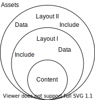

## [Jekyll](https://jekyllrb.com/)

Jekyll is a static site generator (SSG).  
It creates `HTML`, `CSS` and `JavaScript` websites.  

### Install

[Instructions](Docs/GettingStarted/Installation)  

#### Windows

```
# Note: install Ruby via RubyInstaller (Ruby+Devkit)
$: ridk install  # run on the last step of the RubyInstaller

$: gem install jekyll bundler
$: jekyll -v
```

### Local development

See the [step-by-step project](../Projects/step-by-step).  
[Accompanying tutorial](Docs/GettingStarted/StepByStepTutorial).  

#### QuickStart

```
$: jekyll new Root-Jekyll-Project
$: cd Root-Jekyll-Project

$: bundle exec jekyll serve
```

#### Initialize

```
$: bundle init
# Note: add `gem "jekyll"` to the Gemfile

$: bundle
```

#### Serve webpages

```
$: pwd # -> .../path/to/Root-Jekyll-Project
$: bundle exec jekyll serve
```

```
http://localhost:4000/
```

### Execution graph

</a>
